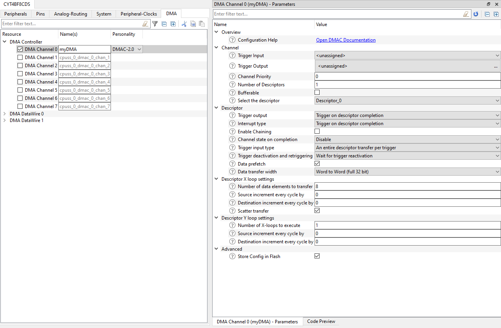
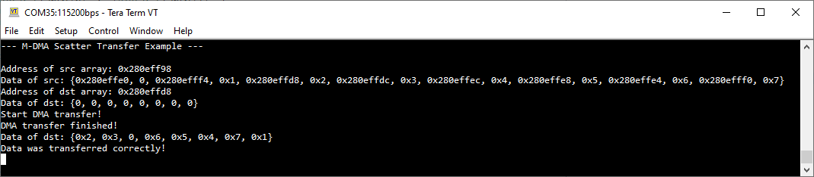

# M-DMA Scatter Transfer
**This code example demonstrates how to use the scatter functionality of the M-DMA block**

## Device
The device used in this code example (CE) is:
- [TRAVEO™ T2G CYT4BF Series](https://www.infineon.com/cms/en/product/microcontroller/32-bit-traveo-t2g-arm-cortex-microcontroller/32-bit-traveo-t2g-arm-cortex-for-body/traveo-t2g-cyt4bf-series/)

## Board
The board used for testing is:
- TRAVEO™ T2G evaluation kit ([KIT_T2G-B-H_LITE](https://www.infineon.com/cms/en/product/evaluation-boards/kit_t2g-b-h_lite/))

## Scope of work
This example shows a memory transfer via *Memory Direct Memory Access* (M-DMA) in scatter mode, which allows to transfer data to multiple locations in memory in one transfer. For this, the source data must be specified in a specific way. In a real application, this can be used to write many configuration values into registers scattered around in memory in one transfer. M-DMA handles these transfers without CPU involvement.

## Introduction

**Memory Direct Memory Access (M-DMA)**

TRAVEO™ T2G Body-High supports two different kinds of DMA:
- Peripheral DMA (P-DMA)
- Memory DMA (M-DMA)

The former is used for peripheral-to-memory (and vice versa) data transfers and thus provides low latency. M-DMA is used for memory-to-memory data transfers and provides high memory bandwidth.

When using DMA, the CPU is not involved in the memory transfers and can do other stuff. This might lead to large performance increases in data-driven applications, therefore it is desired that DMA can handle the transfers as independently as possible. For this, different transfer modes are available. For example, it can be specified that starting from a specific address, every fourth data word up to a specific amount of words shall be copied. 2D transfers, descriptor chaining and more are available and can be looked up in the [Technical Reference Manual (TRM)](https://www.infineon.com/dgdl/?fileId=5546d4627600a6bc017600bfae720007).

One mode, only available on M-DMA, is the scatter transfer. Instead of transferring memory in bulk by increasing the address at each transfer, every data word can be put to a specific location. This is done by having a specific layout in memory. As an example, let's assume the following memory (on the left is the address, and on the right is the content):

0x00000000: 0x10000004

0x00000004: 1

0x00000008: 0x1000000C

0x0000000C: 2

0x00000010: 0x10000000

0x00000014: 3

0x00000018: 0x10000008

0x0000001C: 4

Here, an address and data value alternate in memory. The address specifies where the following data word shall be copied. When starting an M-DMA scatter transfer with the source address as 0x00000000 and amount of words to transfer as 4, the memory at the destination would look like this:

0x10000000: 3

0x10000004: 1

0x10000008: 4

0x1000000C: 2

No destination address has to be specified since all addresses are given for each data word.

More details can be found in [Technical Reference Manual (TRM)](https://www.infineon.com/dgdl/?fileId=5546d4627600a6bc017600bfae720007), [Registers TRM](https://www.infineon.com/dgdl/?fileId=5546d4627600a6bc017600be2aef0004) and [Data Sheet](https://www.infineon.com/dgdl/?fileId=5546d46275b79adb0175dc8387f93228).

## Hardware setup

This CE has been developed for:
- TRAVEO™ T2G evaluation kit lite ([KIT_T2G-B-H_LITE](https://www.infineon.com/cms/en/product/evaluation-boards/kit_t2g-b-h_lite/)) 
   
No changes are required from the board's default settings.

## Implementation

This example consists of one M-DMA scatter transfer started by software. The cache is enabled and coherency is taken care of (see section "Cache coherency" for more details). There is a *src[]*, *dst[]* and *REFERENCE[]* array. The first one contains the layout of the scatter transfer (address and data pair), and the second one holds the data after the transfer. Inside the *REFERENCE[]* array lies the data expected to be seen in *dst[]* after the transfer. It will be compared in the end.

*Note: All arrays are put onto the stack of the main function. To configure the src[] array, addresses of dst[] are used by the &-operator and casted into unsigned integers.*

**STDOUT**

At all steps, current information is printed onto UART and can be read via the terminal program. A helper function *printArrayToUART()* is provided to print a whole array. This is used to indicate the current elements of the arrays and to verify that the data is correct in the end.

Initialization of the GPIO for UART is done in the <a href="https://infineon.github.io/retarget-io/html/group__group__board__libs.html#gaddff65f18135a8491811ee3886e69707"><i>cy_retarget_io_init()</i></a> function.
- Initializes the pin specified by *CYBSP_DEBUG_UART_TX* as UART TX and the pin specified by *CYBSP_DEBUG_UART_RX* as UART RX (these pins are connected to KitProg3 COM port)
- The serial port parameters are 8N1 and 115200 baud

**LED**

The user LED is initialized and will lighten up if the verification at the end of the transfer is successful. Initialization is done via Hardware Abstraction Layer (HAL) in <a href="https://infineon.github.io/mtb-hal-cat1/html/group__group__hal__gpio.html#gab93322030909d3af6a9fc1a3b2eccbaa"><i>cyhal_gpio_init()</i></a>. LED is turned on via <a href="https://infineon.github.io/mtb-hal-cat1/html/group__group__hal__gpio.html#gaf66e7c3ed7b3b0711635d7687ae92291"><i>cyhal_gpio_write()</i></a>.

**M-DMA**

To configure M-DMA, the Device Configurator is used.

   *Figure 1. Device configurator for M-DMA* 

As a resource, the "DMA Controller" is chosen, which is synonymous with M-DMA. "DMA DataWire 0" and "DMA DataWire 1" reflect the two P-DMA controllers available on this device.

When configuring the DMA, *Trigger Input* and *Trigger Output* can be specified. This is used to automatically start or trigger other peripherals via the Trigger Multiplexer available on TRAVEO™ T2G. In this example, the transfer is started manually in software, therefore no signals are needed here.

Further, one or multiple descriptors must be specified. A descriptor is a small part of memory for the DMA to keep track of the current state (like the current source address). Since descriptor chaining is supported, more than one can be specified. In this example, only one is used.

In the descriptor configuration, only the data transfer width is important in this example because 32-bit words are used. No triggering and no interrupts are used (the end will be checked by polling) but can be configured here.

In the X loop settings, 8 elements to copy are specified, even though the source array contains 16 elements. This is because effectively only 8 elements are copied, twice as much is needed for the addresses. As long as scatter transfer is checked, what is done here, DMA will do it properly. No increment on source and destination is needed.

In the Y loop settings, the number of X-loops is set to 1 and all other values to 0. These are default settings for 1D and scatter transfers and are changed when using 2D transfers.

The config is stored in Flash since it will not be changed in the code.

When finished, the configurator provides the following values:
- *myDMA_Descriptor_0* of type <a href="https://infineon.github.io/mtb-pdl-cat1/pdl_api_reference_manual/html/structcy__stc__dmac__descriptor__t.html"><i>cy_stc_dmac_descriptor_t</i></a>.
- *myDMA_Descriptor_0_config* of type <a href="https://infineon.github.io/mtb-pdl-cat1/pdl_api_reference_manual/html/structcy__stc__dmac__descriptor__config__t.html"><i>cy_stc_dmac_descriptor_config_t</i></a>.
- *myDMA_channelConfig* of type <a href="https://infineon.github.io/mtb-pdl-cat1/pdl_api_reference_manual/html/structcy__stc__dmac__channel__config__t.html"><i>cy_stc_dmac_channel_config_t</i></a>.
- *myDMA_HW* macro
- *myDMA_CHANNEL* macro

These have to be used in conjunction with the right functions, as demonstrated in the code. The only addition is to specify the source address via <a href="https://infineon.github.io/mtb-pdl-cat1/pdl_api_reference_manual/html/group__group__dmac__descriptor__functions.html#ga6b71b6054e4e16bb3ba58bfdd5bab2cc"><i>Cy_DMAC_Descriptor_SetSrcAddress()</i></a> explicitly. This cannot be done in the configurator because the addresses are mostly dependent on the application, like in this case the location on the stack. For this, the pointer to the *src[]* array is provided.

**Cache coherency**

When the cache is enabled, data coherency issues can arise if not taken care of. Since DMA accesses memory directly, data may reside in the cache on the CPU side, which the DMA controller cannot read. Therefore, proper cleaning and invalidating of the cache must be done. For this, the functions <a href="https://www.keil.com/pack/doc/CMSIS/Core/html/group__Dcache__functions__m7.html#gabc9e51347dca344c72948c3dba0364fd"><i>SCB_CleanDCache_by_Addr()</i></a> and <a href="https://www.keil.com/pack/doc/CMSIS/Core/html/group__Dcache__functions__m7.html#ga31c2439722ab4dbd0c67b196e3377ca7"><i>SCB_InvalidateDCache_by_Addr()</i></a> are utilized. These functions are available in the *Common Microcontroller Software Interface Standard* (CMSIS) Core component, integrated into the PDL. Following are the locations in code:
1. Before setting the descriptor to the DMA channel, it is cleaned from the cache. Since the descriptor is used by the DMA and was configured by the CPU, it could be stuck in the cache. Additionally, the descriptor is aligned to 32-byte to make cache maintenance simpler. This is automatically done by the device configurator.
2. The source array is cleaned from the cache because DMA needs to read this data, therefore it has to be in memory.
3. Invalidating destination array after DMA transfer finished. It could happen that the old destination array data still resides in the cache. Since DMA changed the data in memory, the data should be invalidated in the cache.

*Note: Invalidation and cleaning are always performed on whole cache lines. When the desired data to clean/invalidate is smaller than a cache line, other data might be affected. This has to be taken into consideration. If problematic (not the case in this example), it might be necessary to align data on 32-byte boundaries.*

**Trigger DMA via software**

To start the DMA transfer via software, it must be manually triggered via *Trigger Multiplexer* (TrigMUX). In the PDL, the function <a href="https://infineon.github.io/mtb-pdl-cat1/pdl_api_reference_manual/html/group__group__trigmux__functions.html#gad3c1d26d25a47bc4beca499bf0407c80"><i>Cy_TrigMux_SwTrigger()</i></a> is available. The trigger line corresponding to the used DMA channel can be found in the datasheet.

**Transfer finish**

To see if the transfer is finished, the status is polled via <a href="https://infineon.github.io/mtb-pdl-cat1/pdl_api_reference_manual/html/group__group__dmac__channel__functions.html#ga7fe55ddff581132a9d35f03cd5941cf8"><i>Cy_DMAC_Channel_GetInterruptStatus()</i></a> and checked against the corresponding bitmask <a href="https://infineon.github.io/mtb-pdl-cat1/pdl_api_reference_manual/html/group__group__dmac__macros__interrupt__masks.html#gafdba1f920225bf6f028437646a5613a0"><i>CY_DMAC_INTR_COMPLETION</i></a>.

**Verification**

After the transfer, the data is checked against the reference array. For this, *memcmp()* of the standard library is used, which checks if all bytes in the memory are equal. If verification was successful, it is printed onto the serial monitor and the LED turns on.

## Run and Test
For this example, a terminal emulator is required for displaying the output. Install a terminal emulator if you do not have one. Instructions in this document use [Tera Term](https://ttssh2.osdn.jp/index.html.en).

After code compilation, perform the following steps for flashing the device:
1. Connect the board to your PC using the provided USB cable through the KitProg3 USB connector.
2. Open a terminal program and select the KitProg3 COM port. Set the serial port parameters to 8N1 and 115200 baud.
3. Program the board using one of the following:
    - Select the code example project in the Project Explorer.
    - In the **Quick Panel**, scroll down, and click **[Project Name] Program (KitProg3_MiniProg4)**.
4. After programming, the code example starts automatically. Confirm that the messages are displayed on the UART terminal:

   *Figure 2. Terminal output on program startup* 
   
   *Note: Since this example does not require any interaction from the user, you will directly see the output of the whole example. Press the reset button on the device to restart the example and print the text again.*

5. You can debug the example to step through the code. In the IDE, use the **[Project Name] Debug (KitProg3_MiniProg4)** configuration in the **Quick Panel**. For details, see the "Program and debug" section in the [Eclipse IDE for ModusToolbox™ software user guide](https://www.cypress.com/MTBEclipseIDEUserGuide).

**Note:** **(Only while debugging)** On the CM7 CPU, some code in *main()* may execute before the debugger halts at the beginning of *main()*. This means that some code executes twice: once before the debugger stops execution, and again after the debugger resets the program counter to the beginning of the *main()*. See [KBA231071](https://community.cypress.com/docs/DOC-21143) to learn about this and for the workaround.

## References 
Relevant Application notes are:
- AN235305 - GETTING STARTED WITH TRAVEO™ T2G FAMILY MCUS IN MODUSTOOLBOX™
- [AN220191](https://www.infineon.com/dgdl/?fileId=8ac78c8c7cdc391c017d0d3aee0b678a) - HOW TO USE DIRECT MEMORY ACCESS(DMA) CONTROLLER IN TRAVEO™ II FAMILY
- [AN224432](https://www.infineon.com/dgdl/?fileId=8ac78c8c7cdc391c017d0d3e423267c2) - MULTI CORE HANDLING IN TRAVEO™ T2G FAMILY

ModusToolbox™ is available online:
- <https://www.infineon.com/modustoolbox>

Associated TRAVEO™ T2G MCUs can be found on:
- <https://www.infineon.com/cms/en/product/microcontroller/32-bit-traveo-t2g-arm-cortex-microcontroller/>

More code examples can be found on the GIT repository:
- [TRAVEO™ T2G Code examples](https://github.com/orgs/Infineon/repositories?q=mtb-t2g-&type=all&language=&sort=)

For additional training, visit our webpage:  
- [TRAVEO™ T2G training](https://www.infineon.com/cms/en/product/microcontroller/32-bit-traveo-t2g-arm-cortex-microcontroller/32-bit-traveo-t2g-arm-cortex-for-body/traveo-t2g-cyt4bf-series/#!trainings)

For questions and support, use the TRAVEO™ T2G Forum:  
- <https://community.infineon.com/t5/TRAVEO-T2G/bd-p/TraveoII>  
